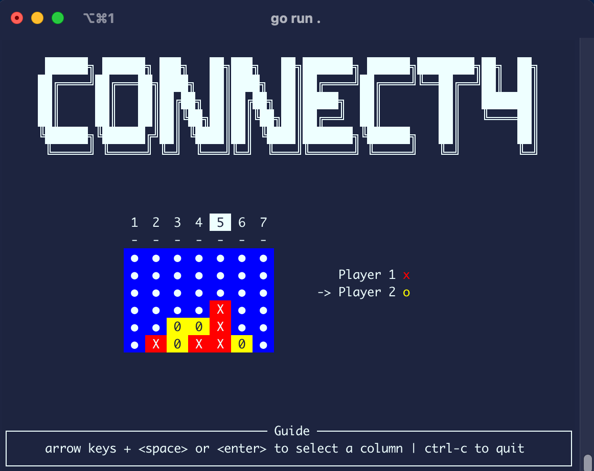

# connect4

Connect4 in the terminal, written in Go.



## Usage

The "game" module contains the bare-bones of a connect4 game. You can run a demo with:

```sh
go run cmd/game/main.go
```

## Proto

Experimenting with gRPC and protocol buffers for multiplayer.

To update the proto files, run:

```sh
./dev/proto.sh
```

Maybe even decentralized??

- [libp2p](https://docs.libp2p.io/guides/getting-started/go/)
